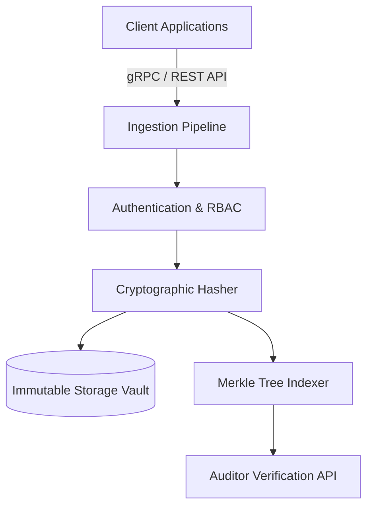

# Audit Vault

> A secure, high-performance, and tamper-evident audit logging and vault system designed for modern cloud and enterprise applications.

---

## Table of Contents

- [Overview](#overview)
- [Key Features](#key-features)
- [Architecture](#architecture)
- [Getting Started](#getting-started)
  - [Prerequisites](#prerequisites)
  - [Installation](#installation)
  - [Configuration](#configuration)
- [Usage](#usage)
  - [Quick Start](#quick-start)
  - [API Examples](#api-examples)
- [Security & Compliance](#security--compliance)
- [Contributing](#contributing)
- [License](#license)

---

## Overview

**Audit Vault** provides centralized, immutable event tracking and cryptographic verification for sensitive enterprise actions. Built for compliance, security operations, and system auditing, Audit Vault ensures all recorded events remain verifiable, transparent, and tamper-proof.

---

## Key Features

- **Cryptographic Immutability**: Uses Merkle tree structures and SHA-256 hashing to guarantee log integrity.
- **High Throughput**: Optimized for low-latency ingest and streaming event processing.
- **Role-Based Access Control (RBAC)**: Strict permission boundaries for reading, auditing, and administering logs.
- **Compliance-Ready**: Designed to meet requirements for SOC2, HIPAA, ISO 27001, and GDPR audit trails.
- **Seamless Integrations**: Out-of-the-box connectors for Webhooks, SIEM tools, and Cloud Storage.

---

## Architecture



---

## Getting Started

### Prerequisites

- Python `>= 3.10`
- Docker & Docker Compose (for local development)

### Installation

Clone the repository and install dependencies:

```bash
git clone https://github.com/Kefmat/audit-vault.git
cd audit-vault
pip install -r requirements.txt
```

### Configuration

Create a `.env` file from the provided template:

```bash
cp .env.example .env
```

Configure your vault settings in `.env`:

```env
HOST=0.0.0.0
PORT=8080
LOG_LEVEL=info
VAULT_SECRET_KEY=your-secure-vault-key
STORAGE_DRIVER=memory # options: memory, file
VAULT_FILE_PATH=vault_log.jsonl
API_TOKEN=your-api-token
```

---

## Usage

### Quick Start

Start the local server using Docker Compose:

```bash
docker-compose up -d
```

Or run directly with Python:

```bash
python -m src.main
```

### API Examples

#### Logging an Audit Event

```bash
curl -X POST http://localhost:8080/v1/audit/events \
  -H "Content-Type: application/json" \
  -H "Authorization: Bearer YOUR_API_TOKEN" \
  -d '{
    "actor": "user_12345",
    "action": "user.password_reset",
    "target": "user_67890",
    "metadata": {
      "ip_address": "192.168.1.1",
      "user_agent": "Mozilla/5.0"
    }
  }'
```

#### Verifying Log Chain Integrity

```bash
curl -X GET http://localhost:8080/v1/audit/verify \
  -H "Authorization: Bearer YOUR_API_TOKEN"
```

---

## Security & Compliance

If you discover a security vulnerability within Audit Vault, please submit a report to `security@example.com` or create a confidential disclosure.

---

## Testing

Run the test suite with:

```bash
pytest tests/
```

---

## Contributing

Contributions are welcome! Please read our [CONTRIBUTING.md](CONTRIBUTING.md) guide before submitting a Pull Request.

1. Fork the repository
2. Create your feature branch (`git checkout -b feature/amazing-feature`)
3. Commit your changes (`git commit -m 'Add amazing feature'`)
4. Push to the branch (`git push origin feature/amazing-feature`)
5. Open a Pull Request

---

## License

Distributed under the MIT License. See [LICENSE](LICENSE) for more information.
